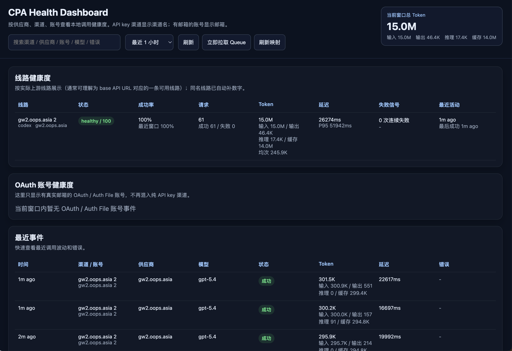

# CPA Health Dashboard

Local health dashboard for **CLIProxyAPI / CPA**.

It consumes CPA `usage-queue`, stores request events in local SQLite, and provides a focused dashboard for:

- **线路健康度**：成功率、连续失败、延迟、Token 用量
- **OAuth / Auth File 账号健康度**
- **最近事件**：快速查看最近调用和错误
- **完整错误弹窗**
- **当前窗口 Token 汇总**

> `usage-queue` 是**消费型队列**。同一时间应只有一个 collector 消费它。

---

## Screenshot



---

## Why this project

`CLIProxyAPI / CPA` 本身提供了 `usage-queue`，但默认并不提供一个专注于：

- 上游线路健康度
- OAuth 账号健康度
- 错误排查
- Token 用量观察

的本地面板。

这个项目就是为此而做：

- 直接消费 `usage-queue`
- 本地落 SQLite
- 用一个简单直接的 Web UI 做健康度展示

---

## Features

- 线路健康度表
  - 成功率
  - 连续失败次数
  - 平均延迟 / P95
  - Token 用量（输入 / 输出 / 推理 / 缓存 / 均次）
- OAuth / Auth File 账号健康度表
- 最近事件表
- 点击查看完整错误内容
- 右上角当前窗口总 Token 汇总
- 支持从 `CPA-Manager` SQLite 导入历史数据

---

## Requirements

- Node.js **22+**
- 一个已启用 Management API 的 `CLIProxyAPI / CPA`

---

## How it works

数据流大致如下：

```text
Client
  -> CLIProxyAPI / CPA (:8317)
      -> usage-queue
          -> CPA Health Dashboard collector
              -> local SQLite
                  -> dashboard UI
```

本项目会访问你的 CPA：

- `/v0/management/usage-queue`
- `/v0/management/codex-api-key`
- `/v0/management/claude-api-key`
- `/v0/management/gemini-api-key`
- `/v0/management/vertex-api-key`
- `/v0/management/openai-compatibility`
- `/v0/management/auth-files`

---

## Configuration

支持两种配置方式：

1. **环境变量**
2. **`config.local.json`**

优先级：

1. 环境变量
2. `config.local.json`
3. 默认值

### Environment variables

参考 `.env.example`：

```bash
export PORT=18317
export CPA_BASE_URL=http://127.0.0.1:8317
export CPA_MANAGEMENT_KEY=replace-me
export DB_PATH=./data/health-dashboard.sqlite
export POLL_INTERVAL_MS=1000
export QUEUE_BATCH_SIZE=100
export MAPPING_REFRESH_MS=300000
export RECENT_WINDOW_MINUTES=15
```

### Local config file

复制 `config.example.json` 为 `config.local.json`，填入你的本地配置。

---

## Quick start

### Start

```bash
./scripts/start.sh
```

### Stop

```bash
./scripts/stop.sh
```

### Status

```bash
./scripts/status.sh
```

### Development

```bash
node src/server.mjs
```

### Open in browser

默认地址：

- [http://127.0.0.1:18317](http://127.0.0.1:18317)

---

## Import history from CPA-Manager

如果你之前在使用 `CPA-Manager`，可以导入它的历史 SQLite：

```bash
node scripts/import-from-cpa-manager.mjs /path/to/usage.sqlite
```

> 注意：如果旧数据源里已经是截断错误文本，则无法恢复为完整错误正文。

---

## Privacy / security

不要提交这些文件：

- `config.local.json`
- `.env`
- `data/*.sqlite`
- `data/server.log`
- `data/server.pid`

管理密钥请通过环境变量或本地配置文件注入，不要写进仓库。

---

## Suggested GitHub description

> Local health dashboard for CLIProxyAPI/CPA. Consumes usage-queue, stores events in SQLite, and shows line health, OAuth account health, errors, latency, and token usage.

## Suggested repository topics

```text
cpa
cliproxyapi
dashboard
monitoring
observability
sqlite
health-check
token-usage
```

---

## Release notes template

See `.github/RELEASE_TEMPLATE_v0.1.0.md`.

---

## License

MIT
